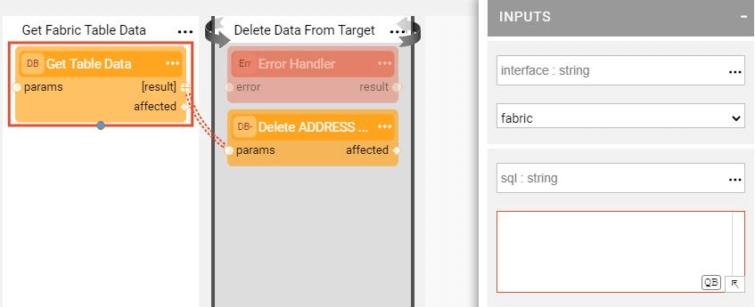
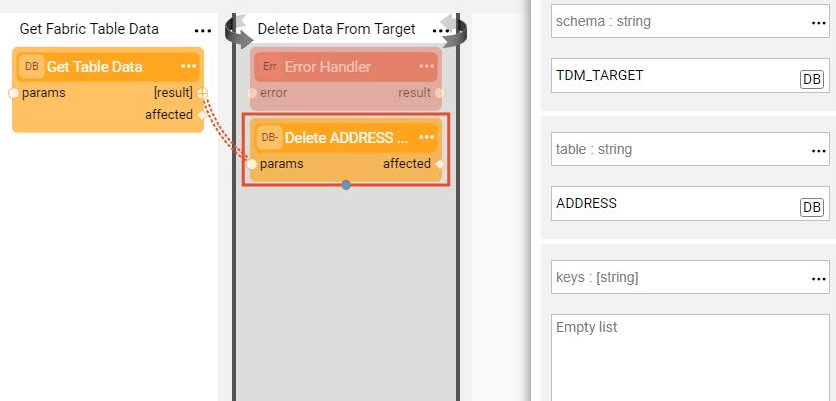
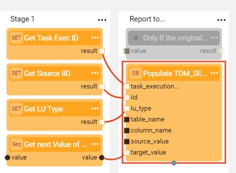

# TDM Implementation Using Generic Flows

The TDM library provides a set of generic flows that enable the creation of a TDM standard implementation just in a couple of minutes.  Do the below steps in order to create a TDM standard implementation using the generic flows.

Note that after the below steps are executed and the standard implementation is created, all the flows can be edited and tailored per your project's specific requirements.

## How Do I Create TDM Implementation?

### Step 1 - Define Tables to Filter Out

A preparation step that must be performed prior to starting the TDM implementation process is to define the tables to be filtered out from the TDM load to target process. The library includes a definition of the following auxiliary tables that must be filtered:

This definition is done using the **TDMFilterOutTargetTables** Actor. If you need more tables to be filtered out from the TDM load, edit the Actor's definition. 

To do so, open the **TDMFilterOutTargetTables** Actor and edit its table input argument. The **lu_name** column should be populated as follows:

* ALL_LUS - when a table is relevant for all TDM's Logical Units.
* [LU name] - when a table belongs to a specific LU.

### Step 2 - Create Load and Delete Flows

Now you are ready to create your TDM implementation using the library flows. Do it by running the generic **createFlowsFromTemplates.flow** from the Shared Objects Broadway folder. The flow is comprised of the following inner flows:

1. #### Create a LOAD flow per table

Performed by the **createLoadTableFlows.flow** that receives the Logical Unit name, target interface and target schema and retrieves the list of tables from the LU's Schema. Then for each one of the tables, it creates a Broadway flow to load the data into this table in the target DB. The name of each of the newly creates flows is **load_[Table Name].flow**, for example load_Customer.flow. The tables defined in Step 2 are filtered out and the flow is not created for them. 

2. #### Create the main LOAD flow

Performed by the **createLoadAllTablesFlow.flow** that receives the Logical Unit name and creates an envelope **LoadTables.flow** Broadway flow. The purpose of this flow is to invoke all the LOAD flows based on the LU's Schema execution order.

3. #### Create a DELETE flow per table

Performed by the **createDeleteTableFlows.flow** that receives the Logical Unit name, target interface and target schema and retrieves the list of tables from the LU's Schema. Then for each one of the tables, it creates a Broadway flow to delete the data from this table in the target DB. The name of each of the newly creates flows is **delete_[Table Name].flow**, for example delete_CUSTOMER.flow. The tables defined in Step 2 are filtered out and the flow is not created for them. 

The following two updates must be performed manually:

* Populate the **sql** input argument with the SELECT query that retrieves which data should be deleted.

  ~~~sql
  SELECT CUSTOMER_ID FROM TAR_CUSTOMER;
  ~~~

  

* Populate the **keys** input argument of the **DbDelete** Actor. These should correlate with the table's key.

  

4. #### Create the main DELETE flow

Performed by the **createDeleteAllTablesFlow.flow** that receives the Logical Unit name and creates an envelope **DeleteAllTables.flow** Broadway flow. The purpose of this flow is to invoke all the DELETE flows in the order opposite to the population order, considering the target DB's foreign keys. 

### Step 3 - Create the TDMOrchestrator.flow from Template

Once all LOAD and DELETE flows are ready, you need to create an orchestrator. The purpose of the **TDMOrchestrator.flow** is to encapsulate all Broadway flows of the TDM task. It includes the invocation of all steps such as:

* Initiate of the TDM load.
* Delete the target data, if required by the task's [operation mode](/articles/TDM/tdm_gui/19_load_task_request_parameters_regular_mode.md#operation-mode) or the [Data Flux load task](/articles/TDM/tdm_gui/20_load_task_dataflux_mode.md[).
* Load the new data into the target, if required by the task's [operation mode](/articles/TDM/tdm_gui/19_load_task_request_parameters_regular_mode.md#operation-mode) or the [Data Flux load task](/articles/TDM/tdm_gui/20_load_task_dataflux_mode.md[). 
* Manage the TDM process as one transaction.
* Perform the [error handling and the statistics gathering](12_tdm_error_handling_and_statistics). 

The **TDMOrchestrator.flow** should be created from the Logical Unit's Broadway template using a template as follows:

### Step 4 - Create the Sequence Initiation Flows

The sequences are required when populating the target DB, thus the sequences definition and initiation is a mandatory part of the TDM implementation creation. These flows need to be defined in the Shared Objects of your project since they need to be available across various Logical Units. 

The examples of sequence initiation flow can be found in the TDM demo project. 

Each sequence initiation flow must include the steps of getting the task execution ID and the original IID from the Fabric, retrieving the next sequence value and populating the TDM_SEQ_MAPPING table. You need to create a flow per each table in your LU's schema. 

[Click for the Sequence Implementation Guidelines](/articles/19_Broadway/actors/08_sequence_implementation_guide.md). 

To create a sequence initiation flow, do the following:

1. Create a flow per each table in your LU's Schema, using the following pattern:

   * Get task execution ID, original IID and LU Type from the session.

   * Get the sequence value using the **MaskingSequence** Actor and setting its input arguments per the project requirements.

     [Click to learn how to set the input arguments of the MaskingSequence Actor](/articles/19_Broadway/actors/07_masking_and_sequence_actors.md#how-do-i-set-masking-input-arguments).

   * Populate the TDM_SEQ_MAPPING table for reporting purpose.

   

2. Save the flow. Then save it as Actor, in order to be able to invoke the flow as [Inner Flow](/articles/19_Broadway/22_broadway_flow_inner_flows.md#save-as-actor).

3. Edit the Load flow of the related table. For example, create a sequence initiation flow for the Payment table. Then edit the **load_PAYMENT.flow** by adding the sequence flow to the **Transformation** Stage and connecting its input and output arguments to the relevant columns.

   

