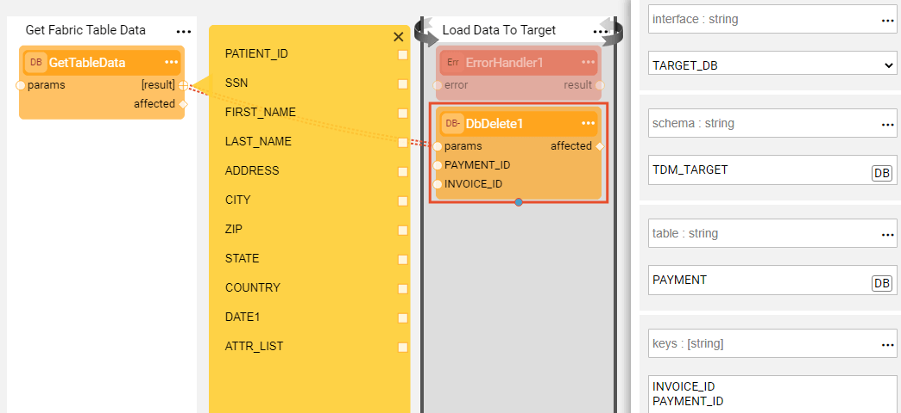

# TDM Implementation Using Generic Flows

The TDM library provides a set of generic flows that enable the creation of a TDM standard implementation just in a couple of minutes.  Below steps should be done in order to create a TDM specific implementation using the generic flows.

Note that after the below steps are executed and the standard implementation is created, all the flows can be edited and tailored per your project's specific requirements.

### How Do I Create TDM Implementation?

Copy the generic Broadway flows and templates as described in the [TDM Generic Broadway Flows](10_tdm_generic_broadway_flows.md) article, then start performing the following steps:

#### Step 1 - Execute the createLoadTableFlows.flow

The **createLoadTableFlows.flow** receives the Logical Unit name and retrieves the list of tables from the LU's Schema. Then for each one the tables, it creates a Broadway flow to load the data into this table in the target DB. The name of each of the newly creates flows is **Load[Table Name].flow**, for example LoadCustomer.flow.

#### Step 2 - Execute the createLoadAllTablesFlow.flow

The **createLoadAllTablesFlow.flow** also receives the Logical Unit name and then it creates a new **LoadTables.flow** Broadway flow which purpose is to invoke all the flows created in Step 1 based on the LU's Schema execution order.

#### Step 3 - Create the Delete Flows

The Delete flows are an important part of the TDM process and currently they need to be implemented manually by creating a set of Broadway flows. To implement the delete functionality, do the following:

1. Create a flow per each table in your LU's Schema under your specific LU, using the following pattern:

   * Get the data from the Fabric TAR_* table. For example, TAR_PAYMENT table.
   * Delete the data from the table in the target DB. For example. PAYMENT table.

   

2. Save the flow as **Delete[Table Name].flow**, for example **DeletePayment.flow**. Then save it as Actor, in order to be able to invoke the flow as [Inner Flow](/articles/19_Broadway/22_broadway_flow_inner_flows.md#save-as-actor).

3. Create an envelop **DeleteAllTables.flow** that invokes all the Delete flows in the order opposite to the population order.

#### Step 4 - Create the TDMOrchestrator.flow from Template

The purpose of the **TDMOrchestrator.flow** is to serve as an envelop that encapsulates all Broadway flows of the TDM task. It includes the invocation of all steps such as initiate of the TDM load, delete of the previous target data and load the new data into the target. It also includes the transaction of the TDM process, the error handling and writing the statistics. The **TDMOrchestrator.flow** should be created from the template as follows:

#### Step 5 - Create the Sequence Initiation Flows

The sequences are required when populating the target DB, thus the sequences definition and initiation is a mandatory part of the TDM implementation creation. These flows need to be defined in the Shared Objects of your project since they need to be available across various Logical Units. 

The examples of sequence initiation flow can be found in the TDM demo project. 

Each sequence initiation flow must include the steps of getting the task execution ID and the original IID from the Fabric, retrieving the next sequence value and populating the TDM_SEQ_MAPPING table. You need to create a flow per each table in your LU's schema. 

[Click for the Sequence Implementation Guidelines](/actors/08_sequence_implementation_guide.md). 

To create a sequence initiation flow, do the following:

1. Create a flow per each table in your LU's Schema, using the following pattern:

   * Get task execution ID, original IID and LU Type from the session.

   * Get the sequence value using the **MaskingSequence** Actor and setting its input arguments per the project requirements.

     [Click to learn how to set the input arguments of the MaskingSequence Actor](/articles/19_Broadway/actors/07_masking_and_sequence_actors.md#how-do-i-set-masking-input-arguments).

   * Populate the TDM_SEQ_MAPPING table for reporting purpose.

   

2. Save the flow. Then save it as Actor, in order to be able to invoke the flow as [Inner Flow](/articles/19_Broadway/22_broadway_flow_inner_flows.md#save-as-actor).

3. Edit the Load flow of the related table. For example, create a sequence initiation flow for the Payment table. Then edit the **LoadPayment.flow** by adding the sequence flow to the **Transformation** Stage and connecting its input and output arguments to the relevant columns.

   

